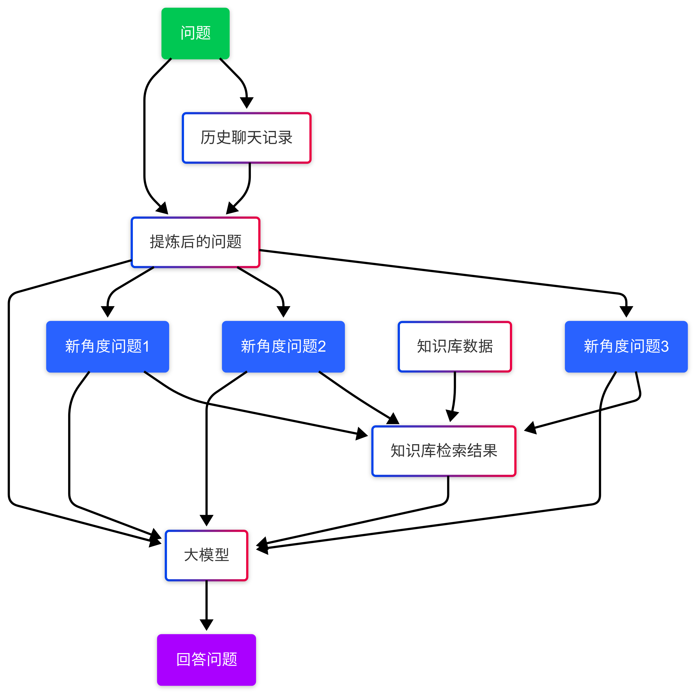

# Development Assistant


## 项目介绍 (Project Introduction)

**Development Assistant** 是一个开源的知识问答服务，旨在为开发者提供快速、准确的技术知识解答。项目深度聚焦于软件开发领域，构建了涵盖多种主流开发语言和技术的知识库，并利用先进的大语言模型技术，为开发者提供强大的技术支持。

我们的目标是打造一个能够不断学习和成长的智能助手，帮助开发者更高效地解决技术难题，提升开发效率。

### 主要特性 (Key Features)

*   **广泛的知识库覆盖**:  目前已涵盖 Python, Java, PHP, SQL, MySQL, HTML, JavaScript, CSS 等主流开发语言和技术栈的知识，并且知识库的宽度和深度都在持续扩展。
*   **强大的知识问答能力**:  基于先进的大语言模型技术，能够理解开发者提出的各种技术问题，并给出准确、详细的解答。
*   **多模型平台支持**:  支持多种主流大语言模型，包括 GPT-3.5, DeepSeek-V3, Llama2-Chinese, Qwen-Max 等，并接入了多家大模型平台，如 Siliconflow 和 Bailian，为用户提供更灵活和强大的模型选择。
*   **向量数据库**:  使用 Weaviate 和 Chroma 向量数据库存储和检索知识向量，提升知识检索效率和准确性。
*   **关系数据库**:  支持 SQLite 和 MySQL 关系数据库，用于存储项目配置和用户数据等。
*   **持续学习与进化**:  知识库和模型能力将不断更新和优化，以适应快速发展的技术 landscape。
*   **开源开放**:  项目完全开源，欢迎开发者社区参与贡献，共同建设更强大的开发助手。

### 技术栈 (Technology Stack)

本项目主要采用以下技术栈进行开发：

*   **后端**:
    *   **Python**:  主要的后端开发语言。
    *   **FastAPI**:  用于构建高性能 API 的现代 Web 框架。
    *   **Langchain**:  用于构建语言模型应用开发的框架。
    *   **LangServe**:  用于部署 Langchain 应用的工具。
    *   **SQL**:  用于数据库操作。
    *   **Poetry**:  Python 依赖管理和打包工具。

*   **前端**:
    *   **HTML**:  构建网页结构。
    *   **JavaScript (JS)**:  实现前端交互逻辑。
    *   **CSS**:  用于网页样式设计。
    *   **React**:  用于构建用户界面的 JavaScript 库。
    *   **npm**:  Node.js 包管理工具。

*   **大语言模型 (Large Language Models)**:
    *   GPT-3.5
    *   DeepSeek-V3
    *   Llama2-Chinese
    *   Qwen-Max
    *   ... (持续增加中)

*   **大模型平台 (LLM Platforms)**:
    *   Siliconflow
    *   Bailian
    *   ... (持续增加中)

*   **向量数据库 (Vector Databases)**:
    *   Weaviate
    *   Chroma

*   **关系数据库 (Relational Databases)**:
    *   SQLite
    *   MySQL


## 问答流程 (Question-Answering Process)


<!--  -->


1.  **用户提问 (User Quesiton)**: 用户通过前端界面输入技术问题。
2.  **获取历史记录 (Getting History)**:  后端系统接收到用户问题，获取用户会话的历史聊天记录。
3.  **信息压缩 (Information Compression)**:  根据用户问题和历史记录，生成一个不依赖历史记录即可理解用户意图的新问题。
4.  **多角度问题 (Multi-angle Question)**:  为了提升检索的准确率，在原有问题的基础上生成多个不同角度的新问题。
5.  **信息检索 (Information Retrieval)**:  使用多个不同角度的新问题分别对知识库进行相关性检索。
6.  **信息汇总 (Information Aggregation)**: 将问题、知识库检索结果、多角度问题汇总。
6.  **模型推理与答案生成 (Model Inference & Answer Generation)**:  将汇总后的信息交给大模型进行问答。
7.  **答案返回 (Answer Return)**:  系统将生成的答案返回给前端，展示给用户。

## 环境配置 (Environment Configuration)

在开始使用 Development Assistant 之前，您需要配置好开发环境。

### 依赖环境 (Dependencies)

*   **Conda**:  推荐使用 Conda 管理 Python 虚拟环境。您可以从 [Conda 官网](https://docs.conda.io/en/latest/miniconda.html) 下载安装 Miniconda 或 Anaconda。
*   **Python**:  推荐使用 Python 3.11 及以上版本。Conda 环境中会自动安装 Python。
*   **Docker**:  如果需要本地部署 Weaviate 向量数据库，请确保安装了 Docker 和 Docker Compose。您可以从 [Docker 官网](https://www.docker.com/) 下载安装。
*   **Node.js 和 npm**:  如果您需要进行前端开发，请确保安装了 Node.js 和 npm。您可以从 [Node.js 官网](https://nodejs.org/) 下载安装。
*   **数据库**:  本项目使用 SQLite (默认) 和 MySQL 作为关系数据库。  如果您需要使用 MySQL，请确保安装并运行 MySQL 数据库服务。

### 环境变量 (Environment Variables)

为了保证项目的正常运行，您需要在根目录下创建 `.env` 文件，并根据 `.env.example` 文件的示例配置以下环境变量：

*   **大模型 API 密钥**:  根据您使用的大语言模型平台 (如 OpenAI, Siliconflow, Bailian 等)，配置相应的 API 密钥。 例如 `OPENAI_API_KEY`, `SILICONFLOW_API_KEY`, `BAILIAN_API_KEY` 等。  具体的环境变量名称请参考各个平台和模型的官方文档和 `.env.example` 文件。
*   **Weaviate 配置**:  如果您使用本地 Docker 部署 Weaviate，需要配置 Weaviate 的连接信息，例如 `WEAVIATE_HOST`, `WEAVIATE_PORT` 等。  如果使用云端 Weaviate 服务，则需要配置相应的连接 URL 和 API 密钥。
*   **数据库配置**:  如果您使用 MySQL 数据库，需要配置 MySQL 数据库连接信息，例如 `MYSQL_HOST`, `MYSQL_PORT`, `MYSQL_USER`, `MYSQL_PASSWORD`, `MYSQL_DATABASE` 等。 如果使用默认的 SQLite 数据库，则无需配置数据库连接信息。

您需要在项目根目录下，复制 `.env.example` 文件并重命名为 `.env`，然后根据您的实际情况修改 `.env` 文件中的配置项。

**设置 `PYTHONPATH` 环境变量**:  为了 Python 能够正确找到项目代码，您需要将 `PYTHONPATH` 环境变量设置为项目的根目录。  例如，如果您的项目根目录是 `/path/to/development_assistant`，则需要设置 `PYTHONPATH=/path/to/development_assistant`。

*   **Linux/macOS**:  可以在 `~/.bashrc` 或 `~/.zshrc` 文件中添加 `export PYTHONPATH=/path/to/development_assistant`，然后执行 `source ~/.bashrc` 或 `source ~/.zshrc` 使配置生效。
*   **Windows**:  可以在 "系统环境变量" 中添加 `PYTHONPATH` 变量，并设置为项目根目录。

## 安装说明 (Installation Instructions)

以下是在本地安装和运行 Development Assistant 的步骤：

1.  **克隆代码仓库 (Clone Repository)**

    打开终端，执行以下命令克隆代码仓库到本地：

    ```bash
    git clone https://github.com/geekmaxi/development_assistant.git
    cd development_assistant
    ```

2.  **创建 Conda 虚拟环境 (Create Conda Virtual Environment)**

    在项目根目录下，创建并激活 Conda 虚拟环境 (推荐命名为 `da_venv`)：

    ```bash
    conda create -n da_venv python=3.11  # 或指定其他 Python 版本
    conda activate da_venv
    ```

3. **安装poetry (Install poetry)**

    ```bash
    curl -sSL https://install.python-poetry.org | python3
    ```

3.  **安装后端依赖 (Install Backend Dependencies)**

    进入项目根目录，使用 `poetry` 安装后端依赖 (首次安装可能需要先安装 `poetry`,  `pip install poetry`)：

    ```bash
    poetry install
    ```

4.  **安装前端依赖 (Install Frontend Dependencies) (如果需要运行前端)**

    进入 `frontend` 目录，使用 `npm` 安装前端依赖：

    ```bash
    cd frontend
    npm install
    ```

5.  **配置 `.env` 文件**

    复制项目根目录下的 `.env.example` 文件，并重命名为 `.env`。  根据 **环境变量配置** 章节的说明，修改 `.env` 文件中的配置项，例如 API 密钥、数据库连接信息等。

6.  **部署 Weaviate (Deploy Weaviate) (如果需要向量数据库)**

    如果您需要使用本地 Docker 部署 Weaviate 向量数据库，请确保已安装 Docker 和 Docker Compose。  在项目根目录下，使用 `docker-compose` 启动 Weaviate 服务：

    ```bash
    docker-compose -f weaviate-docker-compose.yml up -d
    ```

    如果您使用云端 Weaviate 服务，则无需本地部署 Weaviate。

7.  **配置数据库 (Configure Database) (如果需要 MySQL)**

    如果您需要使用 MySQL 数据库，请确保已安装并运行 MySQL 服务。  根据 `.env` 文件中的 MySQL 配置项，创建数据库和用户，并授权访问。 如果使用默认的 SQLite 数据库，则无需此步骤。

## 项目启动 (Project Startup)

完成安装和配置后，您可以按照以下步骤启动 Development Assistant：

1.  **启动后端服务 (Start Backend Service)**

    在激活 Conda 虚拟环境 (`da_venv`) 的终端中，进入项目根目录，运行 FastAPI 应用：

    ```bash
    uvicorn da.starter.main:app --port 8888 --reload  #  开发模式，带热重载
    # 或
    # uvicorn da.starter.main:app --port 8888  #  生产模式
    ```

    请确保您已设置 `PYTHONPATH` 环境变量为项目根目录。

2.  **启动前端应用 (Start Frontend Application) (如果需要运行前端)**

    在另一个终端中，进入 `frontend` 目录，启动 React 应用：

    ```bash
    cd frontend
    npm run dev
    ```

3.  **访问应用 (Access Application)**

    启动成功后，您可以通过浏览器访问前端应用地址[http://localhost:3000](http://localhost:3000)，开始体验 Development Assistant。

## 使用方法 (Usage)

[Image of 项目使用界面截图，例如用户提问框，答案展示区域、知识库浏览界面等]

1.  **打开 Development Assistant 前端页面**。
2.  在提问框中输入您的技术问题，例如 "Python 装饰器如何使用？" 或 "Java HashMap 的底层原理是什么？"。
3.  点击 "提问" 或类似按钮提交问题。
4.  系统会在答案展示区域显示模型生成的答案。
6.  根据答案内容进行参考学习，并可以对答案进行反馈，帮助系统持续优化。

## 贡献指南 (Contributing)

欢迎您为 Development Assistant 项目贡献力量！您可以通过以下方式参与贡献：

*   **提交 Issue**:  如果您发现 Bug 或者有功能建议，请在 [GitHub Issue 页面](https://github.com/geekmaxi/development_assistant/issues) 提交 Issue。
*   **提交 Pull Request (PR)**:  如果您希望贡献代码，修复 Bug 或者增加新功能，请 Fork 本项目，创建您的分支，提交 Pull Request。

    提交 PR 时请注意：
    *   遵循项目的代码风格规范。
    *   提交清晰的 Commit 信息。
    *   如有必要，请编写相应的测试用例。
    *   在 PR 描述中清晰说明您的修改内容和目的。

*   **参与社区讨论**:  欢迎加入我们的社区，参与讨论，分享您的想法和建议。  您可以通过 [GitHub Discussions 页面](https://github.com/geekmaxi/development_assistant/discussions) 参与讨论。

*   **完善知识库**:  项目知识库的建设非常重要，欢迎您贡献新的知识条目，或者改进现有的知识条目，提升知识库的质量和覆盖范围。

## 许可证 (License)

Apache License @ 2024 GeeMaxi

本项目采用 Apache License 开源许可证。

具体许可证内容请参考项目根目录下的 [LICENSE](./LICENSE) 文件。

## 联系方式 (Contact)

如果您有任何问题或建议，欢迎通过以下方式联系我们：

*   [s.showling@gmail.com]
*   [GitHub Discussions 页面链接: https://github.com/geekmaxi/development_assistant/discussions ]

感谢您使用 Development Assistant!  期待您的参与和反馈！

---
**[项目名称: Development Assistant]**  

**[版本号:  v1.0.0]** 
 
**[更新日期: 2025/2/18]**